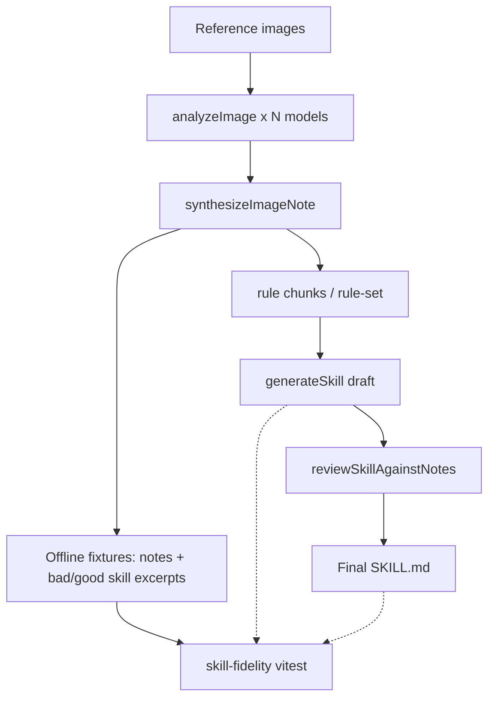

# fix: Preserve frosted-overlay taste fidelity - Plan

## Goal Capsule

**Objective.** Stop the taste pipeline from losing Amigo-style frosted overlays: the generated skill must teach transferable *philosophy + implementable material constraints* for matte frosted overlays over photography, without collapsing them into anti-glassmorphism or unrelated pale circle-overlap modes. Prove it with an offline eval harness and a review/correction loop.

**Product authority.** Session investigation of run `.taste/runs/amigo-catalist-frosted/` + Mobbin/Amigo comparison + live CSS reverse-engineering (`backdrop-filter` ~30px, warm-gray translucent fill, gray border). Philosophy-first: not CSS cloning.

**Stop when.** Offline eval fails the known-bad skill and passes a corrected skill; prompt/unit tests lock the new instructions; local pipeline can run review correction; Definition of Done checklist is green.

---

## Product Contract

### Summary

The Amigo frost miss was primarily a **skill-content** failure (wrong frost philosophy + harmful glassmorphism collapse), not merely bad UI application. The pipeline already aims to extract *why* something works; this plan adds material-recipe fidelity, minority-mode preservation, ban disambiguation, offline skill↔reference assertions, and a post-skill review/correction stage.

### Problem Frame

Vision analyses under-described or denied frosted chips over photos; synthesis diluted minority frost findings; rule/skill stages redefined "frosted" toward pale translucent overlaps and told generators to remove glassmorphism-looking panels — which matches Amigo's real frosted chips. Agents following the skill cannot recover Amigo's material even when they understand editorial layout.

### Requirements

- R1. Analysis prompts must require an explicit **material recipe** when translucent overlays appear over imagery (blur band, fill family/~opacity, border, gloss vs matte, substrate) — philosophy of depth, not brand CSS dump.
- R2. Synthesis must preserve minority material recipes present in either analysis when the image supports them (do not erase frost because of “avoid glassmorphism” priors).
- R3. Chunk/rule/skill prompts must **split bans**: glossy reflective glassmorphism (specular, heavy shadow, chrome) vs matte frosted overlays over rich substrate (allowed/required when evidenced).
- R4. Offline eval asserts skill↔reference fidelity on fixtures from the Amigo frost run (and trimmed excerpts): fail undifferentiated glass bans when frost overlays are evidenced; require positive frosted-overlay constraints.
- R5. A **review/correction** stage compares draft skill (or rule-set) to synthesized notes / fixture expectations and can revise the skill before final write.
- R6. Tests stay npm/vitest-local; no requirement for live LLM calls in CI unit tests. Live re-runs remain optional manual verification.

### Actors

- A1. Pipeline author / agent implementing taste improvements.
- A2. Downstream design agents consuming generated `SKILL.md` (e.g. Catalist `design-taste.md` consumers).

### Key Flows

- F1. Local taste run: corpus → analyze → synthesize → rules → skill → **review/correct** → final `SKILL.md`.
- F2. Offline eval: load fixtures → run content predicates → pass/fail without network.
- F3. Prompt regression: vitest ensures new instruction strings exist and Jaytel-bias phrases stay out of frost-agnostic defaults.

### Acceptance Examples

- AE1. Offline eval fails committed “bad skill excerpt” that bans glassmorphism/frost panels without a positive overlay-over-imagery recipe.
- AE2. Offline eval passes a “good skill excerpt” that distinguishes glossy glass ban from matte frosted overlays over photography (blur/fill/border language allowed as relative constraints).
- AE3. `buildAnalysisPrompt` / `buildSynthesisPrompt` / `buildRuleSetPrompt` / `buildSkillPrompt` contain the new material/ban-split language; existing agnostic prompt tests still pass.
- AE4. Review stage, given a bad draft skill + frost-supporting notes, produces a corrected skill that AE2-style predicates would accept (unit-tested with stubbed provider or pure prompt+parser path as feasible).

### Scope Boundaries

**In scope**
- `packages/ai` prompts, pipeline API, vitest fixtures/eval helpers
- Local runner hook in `scripts/taste-local.ts`
- Optional thin hosted mirror note / hook in `apps/web` rule-stage if low-cost; otherwise defer hosted wiring

**Out of scope**
- Rewriting Catalist DROP pipeline UI again
- Committing large reference images or full run blobs (trim text fixtures only)
- Changing Jaytel example skill’s own anti-frost stance for its neutral-UI corpus
- Live Mobbin scraping in CI
- WebGL research

**Deferred to follow-up**
- Frost close-up crop corpus packaging for live re-runs
- Hosted soft-fail on review disagreement events
- Auto-reanalyze image when both models miss frost but filename/tags imply it

### Key Decisions

- KD1. Skill content + pipeline fidelity is the primary bug; UI application was secondary. *(session-settled: user-approved — Mobbin verification)*
- KD2. Eval asserts philosophy + material constraints vs references — not element-for-element CSS cloning. *(session-settled: user-directed — chosen over CSS dump)*
- KD3. Include review/correction agent loop as a pipeline stage. *(session-settled: user-directed)*
- KD4. Prefer offline fixtures first; stacked prompt fixes so eval can green. *(session-settled: user-approved — confirm go on scoped plan)*
- KD5. Amigo frost = matte overlay-on-imagery; pale circles in photos are atmospheric, not the frosted UI system. Case-study bar overlaps are a separate translucency mode. *(session-settled: user-approved — Mobbin check)*

---

## Planning Contract

### Assumptions

- Trimmed markdown fixtures derived from `.taste/runs/amigo-catalist-frosted/` may be committed under `packages/ai/test/fixtures/` (text only; AGENTS.md allows not committing full run images).
- Review stage may use the same provider credentials as skill generation; unit tests stub the provider or only test prompt construction + deterministic validators.
- Product Contract unchanged from bootstrap (no separate brainstorm file).

### Key Technical Decisions

- KTD1. Insert material-recipe requirements into `buildAnalysisPrompt` (§5 or new §) and mirror in synthesis adjudication. *(session-settled: user-approved — H1/H2 stacked)*
- KTD2. Ban-split language in `buildChunkPrompt` / `buildRuleSetPrompt` / `buildSkillPrompt` collapse guardrails — forbid collapsing evidenced matte frost into glassmorphism removal. *(session-settled: user-approved — H3)*
- KTD3. Offline eval as pure vitest content predicates over fixture files (extend `prompts.test.ts` style phrase lists into a dedicated `skill-fidelity.test.ts` + fixtures). Chosen over live vision CI for determinism/cost.
- KTD4. New `reviewSkillAgainstNotes` (name directional) in `packages/ai` + prompt builder; wire after skill generation in `taste-local.ts`. Lab preference rewrite is inspiration only — not the control loop.
- KTD5. Do not change Jaytel `pipeline/taste/taste-skill/SKILL.md` frost bans for that corpus; frost fixtures document a different taste mode.

### High-Level Technical Design

Review compares draft skill to synthesized notes (and optionally fixture expectations): if skill bans frosted overlays while notes evidence overlay-on-imagery frost, rewrite skill toward positive matte-frost constraints + glossy-only ban.

### Alternatives Considered

| Approach | Why not primary |
|----------|-----------------|
| Eval-only without prompt fixes | Documents the miss forever; does not improve new runs |
| Prompt-only without eval | Regresses silently; Amigo miss would not be caught |
| Live vision CI every PR | Costly/flaky; contradicts AGENTS preference for local deterministic checks |
| Lab preference loop as the fix | Human-in-the-loop demo, not automated pipeline fidelity |

---

## Implementation Units

### U1. Offline skill↔reference fidelity harness

**Goal.** Deterministic vitest suite that fails the known-bad frost skill pattern and passes a good pattern.

**Requirements.** R4, AE1, AE2

**Dependencies.** None

**Files.**
- `packages/ai/test/fixtures/frost-overlay/` (trimmed `bad-skill-excerpt.md`, `good-skill-excerpt.md`, optional `note-excerpts.md` from Amigo run)
- `packages/ai/test/skill-fidelity.test.ts`
- `packages/ai/src/eval/skill-fidelity.ts` (or `packages/ai/src/skill-fidelity.ts`) — pure predicates

**Approach.**
- Predicates such as: if fixture corpus evidences frost-over-imagery, skill must not issue undifferentiated “remove glassmorphism / avoid glass effects / do not use frosted panels” without a positive matte-overlay-over-substrate recipe (blur/fill/border or equivalent relative constraints).
- Good fixture must state glossy reflective ban separately from matte frost allowance/requirement.
- Keep fixtures small (excerpts), with a README note on provenance (Amigo run id / Mobbin insight).

**Patterns to follow.** `packages/ai/test/prompts.test.ts` phrase lists; `pipeline.test.ts` pure functions.

**Test scenarios.**
- Covers AE1. Bad excerpt → `assertSkillFidelity` fails with readable reason.
- Covers AE2. Good excerpt → passes.
- Neutral/editorial skill without frost evidence → predicates no-op or pass (do not force frost language on every skill).
- Empty/malformed skill string → fails safely.

**Verification.** `npm test --workspace @taste/ai` includes the suite. Before U3 lands, bad fixture fails (expected) and good fixture passes. After U3–U4, both remain green; optional live frost corpus re-run is manual only.

**Execution note.** Land harness + bad fixture first so subsequent units have a failing bar to clear.

---

### U2. Analysis + synthesis prompt material fidelity

**Goal.** Force material recipes at vision and preserve them at fusion — philosophy of depth, not CSS cloning.

**Requirements.** R1, R2, AE3

**Dependencies.** U1 (eval language informs required phrases)

**Files.**
- `packages/ai/src/prompts.ts`
- `packages/ai/test/prompts.test.ts`

**Approach.**
- Analysis: when overlays sit on imagery, require Material recipe fields (blur band, fill family/~opacity, border, gloss vs matte, substrate). Disambiguate glossy glass vs matte frost.
- Synthesis: if either analysis reports frosted/translucent overlays over imagery, keep a concrete recipe in material/texture/depth; do not replace with glassmorphism ban alone. Prefer substrate-citing analysis on material conflicts.
- Avoid requiring exact Amigo hex/`30.15px` — relative bands are enough.

**Test scenarios.**
- `buildAnalysisPrompt` contains material-recipe checklist + glossy vs matte split language.
- `buildSynthesisPrompt` contains preserve-minority / overlay-over-imagery adjudication language.
- Existing agnostic / anti-Jaytel-bias tests still pass.

**Verification.** Prompt unit tests green.

---

### U3. Rule + skill prompt ban-split and collapse guardrails

**Goal.** Stop rule/skill stages from redefining frost into circle-overlap-only + remove-glass collapse.

**Requirements.** R3, AE3

**Dependencies.** U2

**Files.**
- `packages/ai/src/prompts.ts`
- `packages/ai/test/prompts.test.ts`
- Optionally update `packages/ai/test/fixtures/frost-overlay/good-skill-excerpt.md` to match intended skill voice

**Approach.**
- Chunk “Prohibited model shortcuts” and rule-set REQUIRED + material + anti-pattern sections: prohibit glossy reflective glassmorphism; when notes evidence frosted overlays on photography, require a positive rule; do not redefine frost as only pale circle overlaps unless that is the dominant evidence.
- Skill prompt collapse guardrail: replace “if glassmorphism → remove transparent glass cards → pale overlap only” with split guidance (remove gloss/specular/heavy shadow; keep matte frosted overlays when evidenced).

**Test scenarios.**
- Rule/skill prompts contain ban-split and positive frost-when-evidenced language.
- Prompts do not instruct undifferentiated removal of frosted panels.
- Existing bias-phrase tests still pass.

**Verification.** Prompt tests green; good fixture still matches intended language.

---

### U4. Review/correction stage

**Goal.** After draft skill generation, review against synthesized notes and correct skill when fidelity predicates would fail.

**Requirements.** R5, AE4, F1

**Dependencies.** U1, U3

**Files.**
- `packages/ai/src/prompts.ts` — `buildSkillReviewPrompt`
- `packages/ai/src/pipeline.ts` — `reviewAndCorrectSkill` (directional name)
- `packages/ai/src/index.ts` — export
- `scripts/taste-local.ts` — call after draft skill, write `04-skill/review.md` + final skill
- `packages/ai/test/pipeline.test.ts` or `skill-review.test.ts`

**Approach.**
- Input: draft skill markdown, concatenated synthesized notes (bounded), optional fidelity failure reasons.
- Output: corrected skill body + short changelog (tagged or JSON — follow existing skill tag pattern if possible).
- If review finds no conflict, return draft unchanged.
- Local runner writes review artifact for audit; final `SKILL.md` is post-review.
- Unit test: stub provider returning a fixed correction; assert parser + that corrected text passes fidelity predicates. Also test no-op path.

**Patterns to follow.** `generateSkill` / `parseSkillGenerationOutput`; lab rewrite is conceptual only.

**Test scenarios.**
- Covers AE4. Stubbed correction turns bad draft into fidelity-pass text.
- No-op when draft already passes.
- Prompt includes notes + draft + “philosophy not CSS dump” instruction.

**Verification.** Unit tests green; optional manual `npm run taste` on frost corpus after credentials available.

**Execution note.** Prefer stubbed provider tests; do not gate CI on live review calls.

---

### U5. Docs + optional hosted hook note

**Goal.** Document the fidelity contract and leave hosted wiring explicit.

**Requirements.** R6

**Dependencies.** U1–U4

**Files.**
- `AGENTS.md` — mention fidelity tests / review stage briefly
- `pipeline/process.md` — document review stage in process list

**Approach.** Keep docs short; point to fixtures as the regression contract. Hosted `apps/web` wiring stays deferred (OQ1) — do not touch `rule-stage.ts` in this plan.

**Test expectation:** none — docs only.

**Verification.** Docs accurate vs implemented stages.

---

## Verification Contract

| Gate | Command / outcome |
|------|-------------------|
| Unit tests | `npm test --workspace @taste/ai` |
| Typecheck | `npm run check --workspace @taste/ai` |
| Fidelity | Bad frost fixture fails predicates; good passes |
| Prompt lock | New material/ban-split strings present; Jaytel bias phrases absent |
| Optional smoke | `npm run taste -- <frost-corpus>` then spot-check `SKILL.md` for ban-split + overlay recipe (manual, needs API key) |

---

## Definition of Done

- [ ] U1–U5 complete as scoped
- [ ] AE1–AE4 satisfied
- [ ] No committed full-resolution Amigo image dumps; fixtures are trimmed text
- [ ] Jaytel example skill left intact for its corpus
- [ ] Review artifact path documented for local runs
- [ ] Open questions either resolved or marked deferred

---

## Open Questions

- OQ1 *(deferred).* Whether hosted `rule-stage` must call review in the same PR or follow-up.
- OQ2 *(deferred).* Whether to add frost close-up crops under a gitignored corpus pack for live re-run demos.
- OQ3 *(deferred).* Soft-fail vs hard-fail when review cannot run (missing credentials) on local CLI.

---

## Risks & Dependencies

| Risk | Mitigation |
|------|------------|
| Over-fitting eval to Amigo wording | Predicates check structure (overlay-on-imagery + glossy-vs-matte split), not brand names |
| Review stage adds cost/latency | Optional flag later; default on for local frost demos; stub in tests |
| Prompt length growth | Keep recipe checklist tight; relative bands not CSS dumps |
| Confusing Jaytel anti-frost example | Fixtures + docs state mode-specific skills |

---

## Sources & Research

- Run artifacts: `.taste/runs/amigo-catalist-frosted/` (notes, rule-set, SKILL)
- Live Amigo CSS: `.glass` / `--glass-blur: 30.15px` (investigation session)
- Mobbin Amigo book-demo: frosted chips over photo ≠ pale-circle UI system
- Code: `packages/ai/src/prompts.ts`, `packages/ai/src/pipeline.ts`, `scripts/taste-local.ts`, `packages/ai/test/`
- Session grounding dossier (ephemeral): compound-engineering `ce-plan-taste-frost` notes from the planning session
